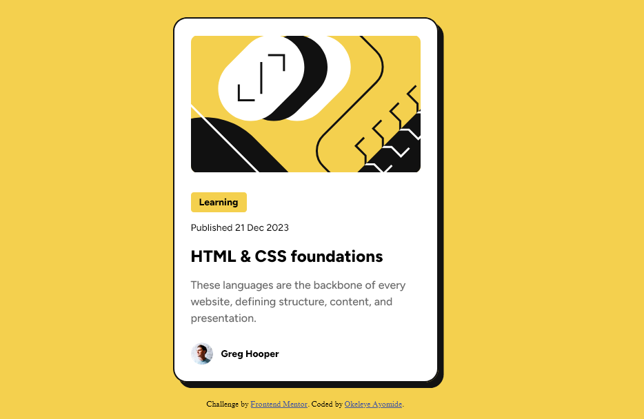
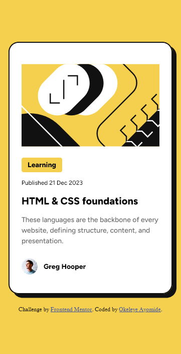

# Frontend Mentor - Blog preview card solution

This is a solution to the [Blog preview card challenge on Frontend Mentor](https://www.frontendmentor.io/challenges/blog-preview-card-ckPaj01IcS). Frontend Mentor challenges help you improve your coding skills by building realistic projects. 

## Table of contents

- [Overview](#overview)
  - [Screenshots](#screenshots)
  - [Links](#links)
- [My process](#my-process)
  - [Built with](#built-with)
  - [What I learned](#what-i-learned)
- [Author](#author)

## Overview

### Screenshots

### Desktop View

### Mobile View

### Links

- Solution URL: [Solution URL](https://github.com/okeleyeayomide08/fem-blog-preview-card)
- Live Site URL: [Live site URL here](https://fem-blog-preview-card-kappa.vercel.app/)

## My process

### Built with

- Semantic HTML5 markup
- CSS custom properties
- Flexbox

### What I learned

I recieved a review in my last project to make my website responsive, I made up my mind that in my next project, I will make it respovsive and now I did it. Thank you Frontend Mentor.

I learnt media queries and responsive design.

## Author

- Frontend Mentor - [@okeleyeayomide08](https://www.frontendmentor.io/profile/okeleyeayomide08)
- Instragram - [@okeleyeayomide08](https://www.instagram.com/okeleyeayomide08/)

